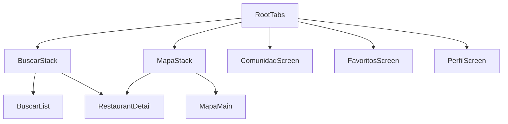

# CeliacSafe

**CeliacSafe — Mobile App für 100% glutenfreie Restaurants in Spanien**

CeliacSafe hilft Menschen mit Zöliakie und Glutenunverträglichkeit, sicher und zuverlässig Restaurants in Spanien zu finden, die ausschließlich glutenfrei kochen. Keine Unsicherheit, keine Kompromisse — nur verifizierte, 100% glutenfreie Lokale.

---

## Status

**In Entwicklung — M06 abgeschlossen: vollständige Detail-Seite**

Die Detail-Ansicht zeigt alle Restaurant-Informationen strukturiert: Hero mit Bild und Badges, Schnellaktionen, Verifizierung, Adresse mit Mini-Map, Beschreibung, Öffnungszeiten, Lieferdienste, Reservierung, Kontakt und rechtlicher Disclaimer. Sektionen erscheinen nur, wenn Daten vorhanden sind.

---

## Tech-Stack

| Technologie                   | Verwendung                                         |
| ----------------------------- | -------------------------------------------------- |
| **Expo SDK 52+**              | Cross-Platform-Framework für iOS und Android       |
| **React Native + TypeScript** | UI und typsichere Entwicklung                      |
| **React Navigation 7**        | Bottom-Tab-Navigation zwischen den Hauptbereichen  |
| **react-native-maps**         | Karte (Apple Maps / Google Maps je nach Plattform) |
| **expo-location**             | Standort nur on-demand (My-Location-Button)        |
| **expo-haptics**              | Haptisches Feedback (Heart-Toggle)                 |

Weitere Tools: ESLint, Prettier, Jest (`jest-expo`), Zustand, `@gorhom/bottom-sheet`, `@expo/vector-icons`, `expo-linear-gradient`, `expo-image`

---

## Setup

### Voraussetzungen

- [Node.js](https://nodejs.org/) (LTS empfohlen)
- [Expo Go](https://expo.dev/go) auf dem Android-Gerät (oder iOS)
- Python 3 + `pip install -r scripts/requirements.txt` (für Daten-Pipeline)

### Installation und Start

```bash
# Abhängigkeiten installieren
npm install

# Entwicklungsserver starten (Tunnel — Standard für Handy-Tests)
npm start
```

### App auf dem Gerät testen

1. `npm start` ausführen — startet Expo im **Tunnel-Modus** (funktioniert auch ohne gleiches WLAN).
2. **Expo Go** auf dem Android-Gerät öffnen.
3. QR-Code scannen — beim ersten Start 30–60 Sekunden warten.

Alternativ:

```bash
npm run start:tunnel   # explizit Tunnel (gleich wie npm start)
npm run start:lan      # nur LAN, wenn Tunnel Probleme macht
```

### Daten-Pipeline

```bash
npm run geocode      # v3.xlsx → v4.xlsx mit Koordinaten (Nominatim + Stadt-Fallback)
npm run data:build   # v4.xlsx → src/data/restaurants.json
python scripts/verify-geo.py   # Koordinaten in JSON prüfen
```

### Code-Qualität

```bash
npm run lint      # ESLint — Fehler und Warnungen prüfen
npm run format    # Prettier — Code automatisch formatieren
npm test          # Jest — Such-/Filter-Logik (searchAndFilter)
```

---

## Geo-Daten

- Jedes Restaurant in `src/data/restaurants.json` enthält **`latitude`** und **`longitude`** (107 Einträge nach Geocoding).
- **`scripts/geocode.py`**: Online-Geocoding via [Nominatim](https://nominatim.openstreetmap.org/) (1,2 s Pause pro Request), Fallback auf Stadt-Mittelpunkt; optional `--fallback-only`.
- **`npm run geocode`**: Erzeugt `data-source/CeliacSafe_Datenbank_v4.xlsx` aus v3.
- **`npm run data:build`**: Exportiert die angereicherte Excel nach JSON für die App.

---

## Berechtigungen

| Berechtigung               | Wann                                    | Zweck                                                      |
| -------------------------- | --------------------------------------- | ---------------------------------------------------------- |
| **Standort (When In Use)** | Nur beim Tap auf den My-Location-Button | Karte auf Nutzerposition zentrieren, blauer Standort-Punkt |

Es wird **kein** Hintergrund-Standort abgefragt. Der Berechtigungstext steht in `app.json` (`NSLocationWhenInUseUsageDescription`).

---

## Projektstruktur

```
celiacsafe/
├── App.tsx                 # Einstiegspunkt (SafeArea, Navigation)
├── scripts/                # geocode.py, excel-to-json.py, verify-geo.py
├── data-source/            # Excel-Quellen (v3, v4)
├── src/
│   ├── screens/            # Bildschirme der App (Buscar, Mapa, Favoritos, …)
│   ├── components/         # Wiederverwendbare UI-Bausteine
│   ├── navigation/         # React-Navigation-Konfiguration (Bottom Tabs)
│   ├── theme/              # Farben, Schriften, Abstände
│   ├── types/              # TypeScript-Typen und Interfaces
│   ├── data/               # Statische Daten (JSON, quickJumps, filterOptions)
│   ├── hooks/              # Eigene React-Hooks
│   ├── utils/              # Hilfsfunktionen
│   ├── store/              # App-State-Management
│   └── i18n/               # Übersetzungen (Spanisch, Deutsch, …)
├── assets/                 # Icons, Splash-Screen, Bilder
└── package.json
```

---

## Komponenten

Wiederverwendbare UI-Bausteine in `src/components/`:

- `RestaurantCard` - Hauptkarte der Suchliste mit Bild, Badges und Favoriten-Icon
- `BadgePill` - Einheitliche Tag-/Badge-Darstellung fuer Status, Cuisine und Preis
- `SearchBar`, `FilterPills`, `FilterBottomSheet` - Suche und Filter (M04)
- `CustomMarker`, `RestaurantMapMarker` - Marken-Pins auf der Karte
- `RestaurantBottomSheet` - Vorschau und Aktionen beim Marker-Tap
- `MyLocationButton`, `RegionQuickJumps` - Standort und Karten-Shortcuts
- `DetailHeader`, `QuickActionsBar`, `VerificationSection`, `AddressSection` - Detail-Seite (M06)
- `DescriptionBlock`, `CuisineTagsRow`, `OpeningHours`, `SeasonalClosureBanner` - Inhalts-Sektionen
- `DeliveryButtons`, `ReservationSection`, `ContactDetailsSection`, `Disclaimer` - Aktionen & Rechtliches

---

## Features (M04 — Filter & Suche)

- **Suche** in Name, Stadt, Region und Cuisine (mehrere Begriffe = UND)
- **Akzent-insensitive Suche** — z. B. „Cataluna“ findet „Cataluña“ (Unicode-NFD)
- **7 Venue-Type-Filter-Pills**, Bottom-Sheet mit Region/Preis/Verifizierung/Sortierung
- **Live-Counter**, **Filter zurücksetzen** im Leerzustand
- Globaler State: **`useFilterStore`** + **`applyFilters`**

---

## Features (M06 — Detail-Seite)

- **Hero** mit Bild, Badges (100% sin gluten, Verifizierung, Preis), Heart-Button mit Haptik
- **Quick-Actions** — Anrufen, WhatsApp, Web, Route (nur wenn Daten vorhanden)
- **Verifizierungs-Transparenz** — Methoden, FACE/AOECS, Datum, Warnung bei alter Verifizierung
- **Adress-Sektion** mit Mini-Map (180pt) und Routing-Button
- **Beschreibung** mit „Leer más“, **Cuisine-Tags**, **Öffnungszeiten** (nur bei Daten)
- **Lieferdienst-Integration** — Glovo, Just Eat, Uber Eats, Wolt, Deliveroo, eigenes Delivery
- **Reservierungs-Buttons** — TheFork, OpenTable, Telefon, Walk-in, Instagram DM
- **Kontakt-Details** — sekundäre Liste (Telefon, Social, E-Mail)
- **Rechtlicher Disclaimer** — dezent hervorgehoben am Seitenende
- **`openExternalUrl`** — plattformübergreifendes Linking (`tel:`, `mailto:`, Maps, Social)

---

## Features (M05 — Karte)

- **107 Pins** auf Spanien-Karte (`react-native-maps`, `PROVIDER_DEFAULT`)
- **RestaurantBottomSheet** — Anrufen, Website, Route, Navigation zu Detail
- **MapaStack** — Detail aus dem Mapa-Tab mit Zurück zur Karte
- **M04-Filter** wirken auf sichtbare Pins (gleicher Zustand-Store)
- **My Location** — `expo-location`, Berechtigung nur on-demand
- **Region-Quick-Jumps** — España, Madrid, Barcelona, Mallorca, Valencia, Andalucía, Euskadi

---

## State Management

- **Zustand** für globalen Filter-State (`src/store/filterStore.ts`)
- **`useFilterStore`** in Buscar- und Mapa-Flow geteilt
- **`applyFilters`** kombiniert Suche, Filter und Sortierung; getestet mit Jest

---

## Navigation-Struktur



---

## Roadmap

| Modul   | Status | Inhalt                                           |
| ------- | ------ | ------------------------------------------------ |
| **M01** | ✅     | Setup — Expo, Navigation, Theme, ESLint/Prettier |
| **M02** | ✅     | Datenmodell & JSON-Pipeline                      |
| **M03** | ✅     | Restaurant-Liste mit Card-Komponente             |
| **M04** | ✅     | Filter & Suche                                   |
| **M05** | ✅     | Karte (Mapa)                                     |
| **M06** | ✅     | Volle Detail-Ansicht                             |
| **M07** | ⏳     | Favoriten & Profil                               |
| **M08** | ⏳     | Community (Comunidad)                            |

---

## Lizenz

**Nicht-kommerziell — alle Rechte vorbehalten.**

Dieses Projekt ist urheberrechtlich geschützt. Eine Nutzung, Vervielfältigung oder Weitergabe ohne ausdrückliche schriftliche Genehmigung des Autors ist nicht gestattet.
