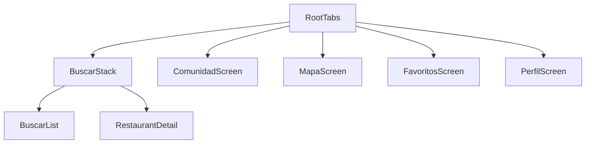

# CeliacSafe

**CeliacSafe — Mobile App für 100% glutenfreie Restaurants in Spanien**

CeliacSafe hilft Menschen mit Zöliakie und Glutenunverträglichkeit, sicher und zuverlässig Restaurants in Spanien zu finden, die ausschließlich glutenfrei kochen. Keine Unsicherheit, keine Kompromisse — nur verifizierte, 100% glutenfreie Lokale.

---

## Status

**In Entwicklung — M04 abgeschlossen: Filter & Suche**

Die Suchliste ist vollständig filterbar: Textsuche mit Akzent-Normalisierung, sieben Venue-Type-Pills, erweiterte Filter im Bottom-Sheet (Region, Preis, Verifizierung, Sortierung), Live-Counter und „Filter zurücksetzen“ im Leerzustand. Globaler Filter-State läuft über Zustand (`useFilterStore`).

---

## Tech-Stack

| Technologie                   | Verwendung                                        |
| ----------------------------- | ------------------------------------------------- |
| **Expo SDK 52+**              | Cross-Platform-Framework für iOS und Android      |
| **React Native + TypeScript** | UI und typsichere Entwicklung                     |
| **React Navigation 7**        | Bottom-Tab-Navigation zwischen den Hauptbereichen |

Weitere Tools: ESLint, Prettier, Jest (`jest-expo`), Zustand, `@gorhom/bottom-sheet`, `@expo/vector-icons`

---

## Setup

### Voraussetzungen

- [Node.js](https://nodejs.org/) (LTS empfohlen)
- [Expo Go](https://expo.dev/go) auf dem Android-Gerät (oder iOS)

### Installation und Start

```bash
# Abhängigkeiten installieren
npm install

# Entwicklungsserver starten (Tunnel — Standard für Handy-Tests)
npm start
```

### App auf dem Gerät testen

1. `npm start` ausführen — startet Expo im **Tunnel-Modus** (funktioniert auch ohne gleiches WLAN).
2. **Expo Go** auf dem Android-Gerät öffnen.
3. QR-Code scannen — beim ersten Start 30–60 Sekunden warten.

Alternativ:

```bash
npm run start:tunnel   # explizit Tunnel (gleich wie npm start)
npm run start:lan      # nur LAN, wenn Tunnel Probleme macht
```

### Code-Qualität

```bash
npm run lint      # ESLint — Fehler und Warnungen prüfen
npm run format    # Prettier — Code automatisch formatieren
npm test          # Jest — Such-/Filter-Logik (searchAndFilter)
```

---

## Projektstruktur

```
celiacsafe/
├── App.tsx                 # Einstiegspunkt (SafeArea, Navigation)
├── src/
│   ├── screens/            # Bildschirme der App (Buscar, Mapa, Favoritos, …)
│   ├── components/         # Wiederverwendbare UI-Bausteine
│   ├── navigation/         # React-Navigation-Konfiguration (Bottom Tabs)
│   ├── theme/              # Farben, Schriften, Abstände
│   ├── types/              # TypeScript-Typen und Interfaces
│   ├── data/               # Statische Daten (JSON, Restaurant-Listen)
│   ├── hooks/              # Eigene React-Hooks
│   ├── utils/              # Hilfsfunktionen
│   ├── store/              # App-State-Management
│   └── i18n/               # Übersetzungen (Spanisch, Deutsch, …)
├── assets/                 # Icons, Splash-Screen, Bilder
└── package.json
```

| Ordner            | Beschreibung                                                 |
| ----------------- | ------------------------------------------------------------ |
| `src/screens/`    | Vollständige App-Bildschirme — ein Screen pro Tab oder Flow  |
| `src/components/` | Kleine, wiederverwendbare UI-Teile (Buttons, Karten, Badges) |
| `src/navigation/` | Tab- und Stack-Navigator, Routing-Konfiguration              |
| `src/theme/`      | Zentrales Design-System (Farben, Typografie, Spacing)        |
| `src/types/`      | Gemeinsame TypeScript-Definitionen (Restaurant, Filter, …)   |
| `src/data/`       | Statische JSON-Daten und Daten-Pipeline-Quellen              |
| `src/hooks/`      | Custom Hooks (z. B. Favoriten, Suche, Standort)              |
| `src/utils/`      | Pure Hilfsfunktionen ohne React-Abhängigkeit                 |
| `src/store/`      | Globaler App-State (Context, Zustand o. Ä.)                  |
| `src/i18n/`       | Mehrsprachige Texte und Lokalisierung                        |

---

## Komponenten

Wiederverwendbare UI-Bausteine in `src/components/`:

- `RestaurantCard` - Hauptkarte der Suchliste mit Bild, Badges und Favoriten-Icon
- `BadgePill` - Einheitliche Tag-/Badge-Darstellung fuer Status, Cuisine und Preis
- `SkeletonCard` - Lade-Platzhalter mit Pulse-Animation fuer Listen
- `EmptyState` - Leerer Zustand mit Icon, Titel und optionaler Beschreibung
- `SearchBar` - Suchfeld mit Clear-Button, angebunden an `useFilterStore`
- `FilterPills` - Horizontale Venue-Type-Pills und „Más filtros“-Einstieg
- `FilterBottomSheet` - Region, Preis, Verifizierung (FACE/AOECS), Sortierung

---

## Features (M04 — Filter & Suche)

- **Suche** in Name, Stadt, Region und Cuisine (mehrere Begriffe = UND)
- **Akzent-insensitive Suche** — z. B. „Cataluna“ findet „Cataluña“ (Unicode-NFD)
- **7 Venue-Type-Filter-Pills** (Restaurant, Café, Hotel, …)
- **Bottom-Sheet** mit Region, Preis, Verifizierung und Sortierung (`@gorhom/bottom-sheet`)
- **Live-Counter** der gefilterten Ergebnisse
- **Filter zurücksetzen** — im Bottom-Sheet und im Empty-State („Limpiar filtros“)

---

## State Management

- **Zustand** für globalen Filter-State (`src/store/filterStore.ts`)
- **`useFilterStore`** wird in `SearchBar`, `FilterPills`, `FilterBottomSheet` und `BuscarScreen` geteilt
- **`applyFilters`** (`src/utils/searchAndFilter.ts`) kombiniert Suche, Filter und Sortierung; getestet mit Jest

---

## Navigation-Struktur



---

## Roadmap

| Modul   | Status | Inhalt                                           |
| ------- | ------ | ------------------------------------------------ |
| **M01** | ✅     | Setup — Expo, Navigation, Theme, ESLint/Prettier |
| **M02** | ✅     | Datenmodell & JSON-Pipeline                      |
| **M03** | ✅     | Restaurant-Liste mit Card-Komponente             |
| **M04** | ✅     | Filter & Suche                                   |
| **M05** | ⏳     | Karte (Mapa)                                     |
| **M06** | ⏳     | Volle Detail-Ansicht                             |
| **M07** | ⏳     | Profil & Einstellungen                           |
| **M08** | ⏳     | Community (Comunidad)                            |

---

## Lizenz

**Nicht-kommerziell — alle Rechte vorbehalten.**

Dieses Projekt ist urheberrechtlich geschützt. Eine Nutzung, Vervielfältigung oder Weitergabe ohne ausdrückliche schriftliche Genehmigung des Autors ist nicht gestattet.
