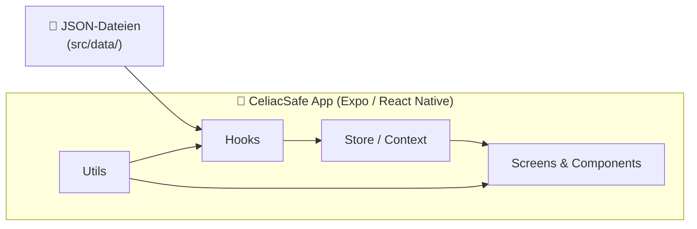
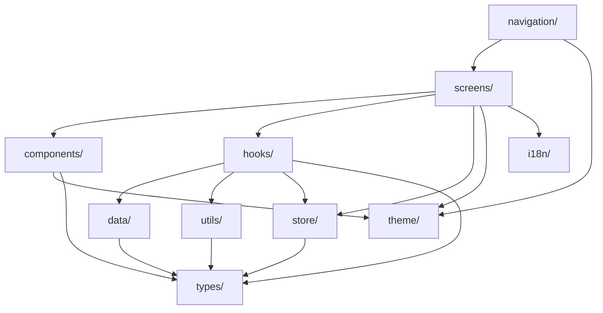
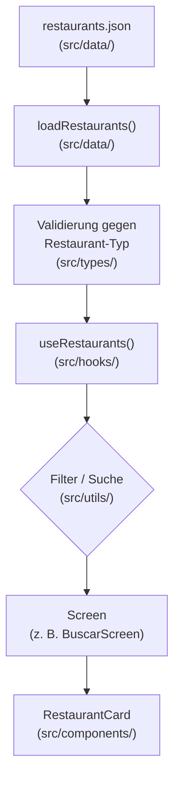
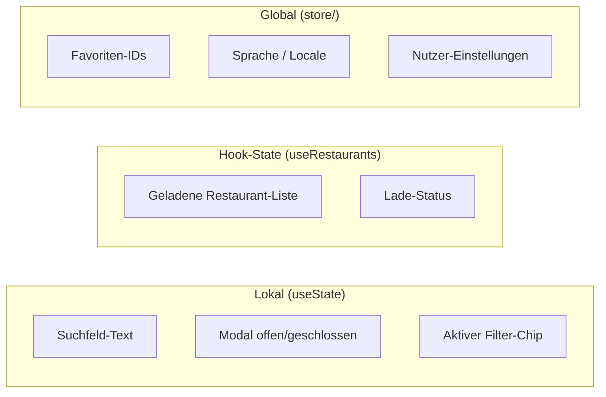

# CeliacSafe — Architektur

Dieses Dokument beschreibt die technische Architektur der CeliacSafe-App: wie Code organisiert ist, wie Daten fließen und wo welcher State liegt.

---

## 1. Architektur-Überblick

CeliacSafe ist eine **reine Client-App** ohne eigenes Backend. Alle Restaurant-Daten liegen als **statische JSON-Dateien** im Projekt und werden beim App-Start bzw. bei Bedarf geladen, gefiltert und in der UI dargestellt.



### Kernprinzipien

| Prinzip                | Bedeutung                                                                           |
| ---------------------- | ----------------------------------------------------------------------------------- |
| **Client-only**        | Kein Server, keine API, keine Datenbank — alles läuft auf dem Gerät                 |
| **JSON-basiert**       | Restaurant-Listen, Metadaten und Konfiguration als versionierte JSON-Dateien        |
| **Offline-first**      | Daten sind mit der App gebündelt; keine Netzwerk-Abhängigkeit für Kernfunktionen    |
| **Schichten-Trennung** | UI, Logik, Daten und State sind klar getrennt (`screens`, `hooks`, `data`, `store`) |
| **TypeScript überall** | Typen in `src/types/` sichern Datenverträge zwischen Schichten ab                   |

### Was bewusst _nicht_ vorgesehen ist (Phase 1)

- Kein REST- oder GraphQL-Backend
- Keine Cloud-Datenbank (Firebase, Supabase, …)
- Keine Echtzeit-Synchronisation zwischen Geräten

Community-Features (Modul M08) können später optional ein Backend ergänzen — bis dahin gilt die JSON-Pipeline als Single Source of Truth.

---

## 2. Ordner-Struktur

```
celiacsafe/
├── App.tsx                    # App-Einstieg: Provider, Navigation, StatusBar
├── assets/                    # Bilder, Icons, Splash (kein App-Code)
├── docs/                      # Projektdokumentation (dieses Dokument)
└── src/
    ├── screens/               # Vollständige Bildschirme
    ├── components/            # Wiederverwendbare UI-Bausteine
    ├── navigation/            # Navigator-Konfiguration
    ├── theme/                 # Design-Tokens (Farben, Spacing, …)
    ├── types/                 # TypeScript-Interfaces & Typen
    ├── data/                  # JSON-Quelldaten & Lade-Logik
    ├── hooks/                 # Custom React Hooks
    ├── utils/                 # Pure Hilfsfunktionen
    ├── store/                 # Globaler App-State
    └── i18n/                  # Übersetzungen
```

### Was gehört wohin?

| Ordner            | Inhalt                                                                                                                                      | Beispiele                                   |
| ----------------- | ------------------------------------------------------------------------------------------------------------------------------------------- | ------------------------------------------- |
| **`screens/`**    | Ganze Bildschirme, die Navigation ansteuert. Orchestrieren Hooks, Store und Components — enthalten **keine** tiefen Business-Logik-Details. | `BuscarScreen.tsx`, `MapaScreen.tsx`        |
| **`components/`** | Kleine, wiederverwendbare UI-Teile ohne eigene Datenquelle. Bekommen alles über Props.                                                      | `RestaurantCard.tsx`, `FilterChip.tsx`      |
| **`navigation/`** | Tab- und Stack-Navigator, Route-Typen, Tab-Icons. Keine UI-Logik.                                                                           | `RootTabs.tsx`                              |
| **`theme/`**      | Zentrale Design-Werte — Farben, Schriften, Abstände. Keine Komponenten.                                                                     | `colors.ts`, `spacing.ts`                   |
| **`types/`**      | Gemeinsame TypeScript-Definitionen, die mehrere Schichten nutzen.                                                                           | `Restaurant.ts`, `FilterOptions.ts`         |
| **`data/`**       | JSON-Dateien **und** Funktionen zum Laden/Parsen/Validieren. Keine React-Abhängigkeit.                                                      | `restaurants.json`, `loadRestaurants.ts`    |
| **`hooks/`**      | Custom Hooks: kapseln Datenladen, Filterlogik, Favoriten. Verbinden `data/` mit UI/Store.                                                   | `useRestaurants.ts`, `useFavorites.ts`      |
| **`utils/`**      | Pure Funktionen ohne React- oder Expo-Abhängigkeit.                                                                                         | `filterRestaurants.ts`, `formatDistance.ts` |
| **`store/`**      | Globaler State (Context, Zustand o. Ä.) für datenübergreifende Zustände.                                                                    | `FavoritesContext.tsx`                      |
| **`i18n/`**       | Übersetzungsdateien und Hilfsfunktionen für Mehrsprachigkeit.                                                                               | `es.ts`, `de.ts`                            |

### Abhängigkeitsregeln



**Faustregel:** Abhängigkeiten fließen von oben (UI) nach unten (Daten/Typen). `utils/` und `types/` importieren nichts aus `screens/` oder `hooks/`.

---

## 3. Daten-Fluss

Restaurants wandern vom JSON in die UI über eine klar definierte Pipeline — ohne Backend.



### Schritt für Schritt

1. **Quelldaten** — `src/data/restaurants.json` enthält alle Restaurant-Einträge (Name, Stadt, Koordinaten, Tags, …).
2. **Laden & Validieren** — `loadRestaurants()` liest und parst die JSON-Datei und mappt sie auf den `Restaurant`-Typ aus `src/types/`.
3. **Hook** — `useRestaurants()` kapselt das Laden, hält die Liste im Hook-State und stellt sie Screens bereit.
4. **Filtern & Sortieren** — Pure Funktionen in `src/utils/` (z. B. `filterByCity()`, `searchByName()`) verarbeiten die Liste — ohne Side Effects.
5. **Screen** — `BuscarScreen` ruft den Hook auf, wendet Filter an und übergibt einzelne Einträge an Components.
6. **Component** — `RestaurantCard` rendert nur die übergebenen Props — kennt keine JSON-Quelle.

### Geplante JSON-Struktur (Beispiel)

```json
{
  "version": "1.0.0",
  "updatedAt": "2026-05-30",
  "restaurants": [
    {
      "id": "rest-001",
      "name": "La Mesa Sin Gluten",
      "city": "Barcelona",
      "province": "Barcelona",
      "lat": 41.3874,
      "lng": 2.1686,
      "tags": ["100% glutenfrei", "Zöliakie-zertifiziert"],
      "verified": true
    }
  ]
}
```

Der zugehörige TypeScript-Typ lebt in `src/types/Restaurant.ts` — nicht in der Screen-Datei.

---

## 4. State Management

Nicht alles braucht globalen State. CeliacSafe unterscheidet drei Ebenen:



### Wo liegt welcher State?

| State                        | Ebene          | Ort                       | Beispiel                            |
| ---------------------------- | -------------- | ------------------------- | ----------------------------------- |
| UI-Zustand eines Screens     | **Lokal**      | `useState` im Screen      | Suchbegriff, Sortierreihenfolge     |
| Geladene Daten + Ableitungen | **Hook**       | `src/hooks/`              | Restaurant-Liste nach Filter        |
| App-weite Persistenz         | **Global**     | `src/store/`              | Favoriten, Sprache, Onboarding-Flag |
| Statische Konfiguration      | **Kein State** | `src/data/`, `src/theme/` | JSON-Dateien, Farben                |

### Entscheidungsregel

```
Ist der State nur für einen Screen relevant?     → useState im Screen
Wird der State von mehreren Screens genutzt?   → Hook oder Store
Muss der State nach App-Neustart erhalten bleiben? → Store + AsyncStorage
```

**Favoriten** sind der erste Kandidat für globalen State in `src/store/`: mehrere Tabs (Buscar, Mapa, Favoritos) greifen darauf zu, und die IDs sollten lokal persistiert werden.

---

## 5. Naming Conventions

Einheitliche Benennung hält das Projekt lesbar — besonders wichtig, wenn es wächst.

### Dateien & Ordner

| Art                       | Konvention                 | Beispiel               |
| ------------------------- | -------------------------- | ---------------------- |
| React-Komponente (Screen) | `PascalCase` + `Screen`    | `BuscarScreen.tsx`     |
| React-Komponente (UI)     | `PascalCase`               | `RestaurantCard.tsx`   |
| Custom Hook               | `camelCase` + `use`-Präfix | `useRestaurants.ts`    |
| Utility-Funktion          | `camelCase`                | `filterRestaurants.ts` |
| TypeScript-Typ/Interface  | `PascalCase`               | `Restaurant.ts`        |
| JSON-Datendatei           | `kebab-case`               | `restaurants.json`     |
| Theme-Token               | `camelCase` (Objekt-Keys)  | `colors.primary`       |

### Code

```typescript
// ✅ Komponente: PascalCase
export function RestaurantCard({ restaurant }: RestaurantCardProps) { ... }

// ✅ Hook: camelCase mit use-Präfix
export function useRestaurants() { ... }

// ✅ Funktion: camelCase, Verb zuerst
export function filterByCity(restaurants: Restaurant[], city: string) { ... }

// ✅ Typ/Interface: PascalCase
export interface Restaurant { ... }
export type FilterOptions = { ... }

// ✅ Konstante (unveränderlich): SCREAMING_SNAKE_CASE
export const MAX_SEARCH_RESULTS = 50;

// ✅ Theme-Export: camelCase-Objekt
export const colors = { primary: '#A5D6A7', ... };
```

### Import-Reihenfolge

1. Externe Pakete (`react`, `expo`, `@react-navigation/…`)
2. Interne Module (`../hooks/…`, `../components/…`)
3. Typen (`import type { … }`)
4. Theme / Konstanten

### Sprache im Code

| Bereich                              | Sprache                                              |
| ------------------------------------ | ---------------------------------------------------- |
| Code (Variablen, Funktionen, Typen)  | Englisch                                             |
| UI-Texte (sichtbar für Nutzer)       | Spanisch (Primärsprache), später Deutsch via `i18n/` |
| Dokumentation (`docs/`, `README.md`) | Deutsch                                              |

---

## Weiterführend

- [README.md](../README.md) — Setup und Roadmap
- Modul **M02** — Datenmodell & JSON-Pipeline (nächster Schritt)
- Modul **M03** — Restaurant-Liste (erster sichtbarer Daten-Fluss in der UI)
